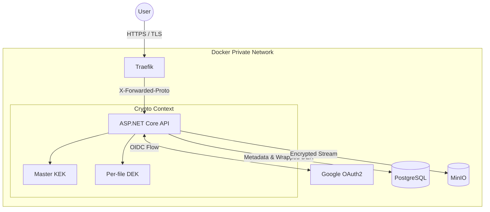

# Secure Media Vault

   

**Secure Media Vault** is a self-hosted, encrypted cloud storage solution built with a "Privacy First" approach. Unlike traditional cloud storage, this system implements **Envelope Encryption**, ensuring that data encryption keys are stored separately from the encrypted data blobs.

## Key Features

  * **Envelope Encryption:** Implements a sophisticated cryptographic architecture where every file has a unique **DEK** (Data Encryption Key), which is encrypted by a Master **KEK** (Key Encryption Key).
  * **Streaming Encryption:** File processing happens "on-the-fly" using C\# Streams. This allows uploading/downloading multi-gigabyte files with minimal RAM usage.
  * **Zero-Trust Network:** All internal components (Database, Storage, API) are hidden behind a **Reverse Proxy** inside an isolated Docker network.
  * **OIDC Authentication:** Secure passwordless login via **Google OAuth2**. Session management via custom **JWT Bearer** tokens.
  * **S3-Compatible Storage:** Uses MinIO as the storage backend, making the system cloud-agnostic (easy migration to AWS S3/Azure Blob).

## Tech Stack

| Component | Technology | Description |
| :--- | :--- | :--- |
| **Backend** | **.NET 8 (ASP.NET Core)** | High-performance Web API |
| **Database** | **PostgreSQL + EF Core** | Stores metadata and encrypted DEKs |
| **Storage** | **MinIO** | S3-compatible object storage for encrypted blobs |
| **Gateway** | **Traefik** | Reverse Proxy, TLS Termination, Routing |
| **Security** | **AES-256 (GCM/CBC)** | Cryptographic standards used |
| **Frontend** | **Vanilla JS (SPA)** | Lightweight frontend to demonstrate API capabilities |

## Architecture

The system is orchestrated via Docker Compose. External traffic enters through Traefik via HTTPS, while internal communication remains efficient over HTTP.



## Security Deep Dive

### How Encryption Works

1.  **Upload:**
      * The API generates a random 256-bit **DEK**.
      * The file is encrypted using the DEK (AES-CBC) and streamed to MinIO.
      * The DEK is encrypted using the Master **KEK** (AES-GCM) and stored in PostgreSQL.
      * The plaintext DEK is wiped from memory.
2.  **Download:**
      * The API retrieves the encrypted DEK from PostgreSQL.
      * The DEK is unwrapped using the KEK.
      * The encrypted file stream is pulled from MinIO, decrypted on the fly, and piped to the user.

## Getting Started

Follow these steps to run the project locally.

### Prerequisites

  * Docker & Docker Desktop
  * .NET 8 SDK (optional, for local debugging)
  * Git

### 1\. Clone the Repository

```bash
git clone https://github.com/Hzktoo/SecureMediaVault.git
cd SecureMediaVault
```

### 2\. Setup Environment Variables

Create a `.env` file in the root directory:

```ini
# Database
POSTGRES_USER=mediauser
POSTGRES_PASSWORD=SecurePassword123!
POSTGRES_DB=mediadb

# MinIO (S3)
MINIO_ROOT_USER=minioadmin
MINIO_ROOT_PASSWORD=MinioSecure123!

# Google OAuth (Get these from Google Cloud Console)
GOOGLE_CLIENT_ID=your_google_client_id
GOOGLE_CLIENT_SECRET=your_google_client_secret

# JWT Configuration
JWT_SECRET_KEY=your_generated_base64_secret_key_min_32_chars
JWT_ISSUER=secure-media-vault
JWT_AUDIENCE=secure-media-vault
```

### 3\. Setup Master Key (KEK)

Create a `secrets` folder and a file containing your 64-character hex key. This key **encrypts all other keys**.

```bash
mkdir secrets
# Example key generation (DO NOT use this one)
echo "f3a12b9c876e45d09f7a6c3b0d1e2f4a59867c4d3e2b1a0f9876543210abcdef" > secrets/kek.txt
```

### 4\. Configure Local DNS (`lvh.me`)

To support Google OAuth redirects on localhost, we use `lvh.me` (which resolves to 127.0.0.1). Add this to your hosts file:

**Windows:** `C:\Windows\System32\drivers\etc\hosts`  
**Linux/Mac:** `/etc/hosts`

```text
127.0.0.1       api.lvh.me
127.0.0.1       traefik.lvh.me
127.0.0.1       minio.lvh.me
```

### 5\. Generate Self-Signed Certificates

Run this command (using Git Bash or OpenSSL) to generate certificates for HTTPS:

```bash
mkdir certs
openssl req -x509 -nodes -days 365 -newkey rsa:2048 \
  -keyout certs/key.pem \
  -out certs/cert.pem \
  -subj "//CN=api.lvh.me" \
  -addext "subjectAltName=DNS:api.lvh.me,DNS:traefik.lvh.me,DNS:minio.lvh.me,IP:127.0.0.1"
```

### 6\. Run the Application

```bash
docker compose up -d --build
```

## Usage

Once the containers are running:

1.  Open **[https://api.lvh.me](https://api.lvh.me)** in your browser.
2.  Click **"Sign in with Google"**.
3.  Upload files and view them in the secure gallery.

### Additional Tools

  * **Swagger UI:** [https://api.lvh.me/swagger](https://www.google.com/search?q=https://api.lvh.me/swagger)
  * **Traefik Dashboard:** [https://traefik.lvh.me](https://www.google.com/search?q=https://traefik.lvh.me)
  * **MinIO Console:** [https://minio.lvh.me](https://www.google.com/search?q=https://minio.lvh.me)

